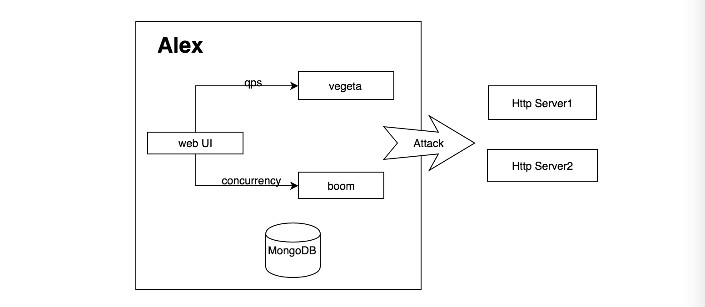
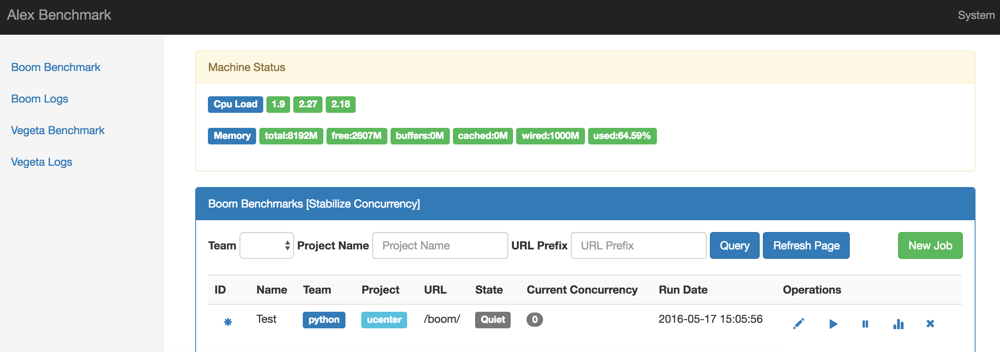
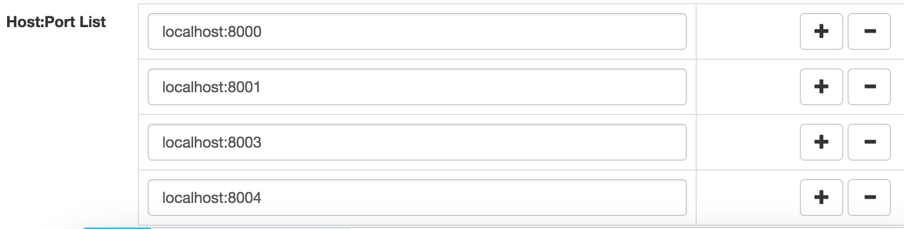
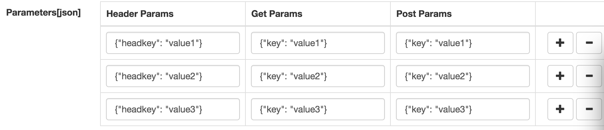
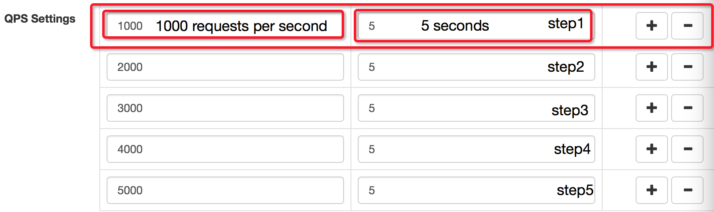
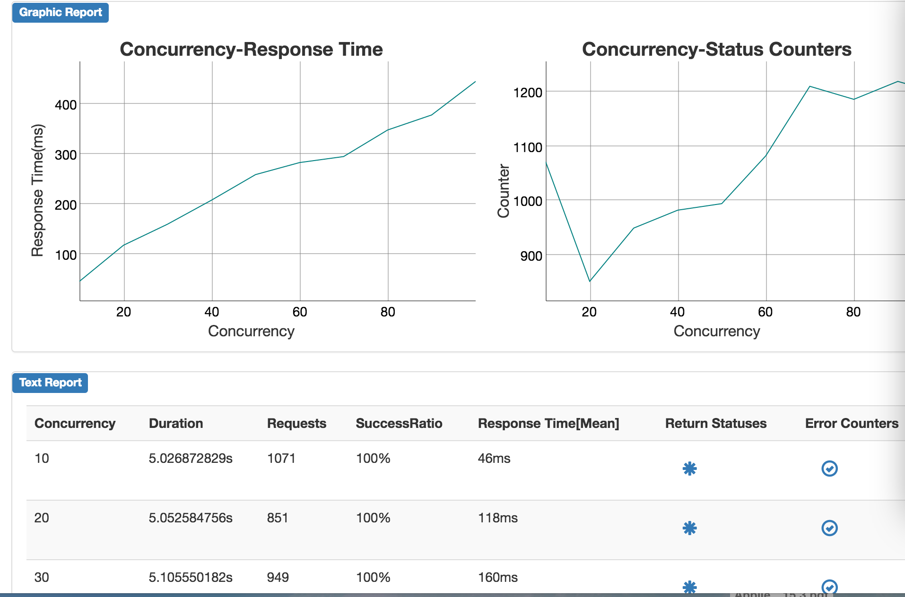
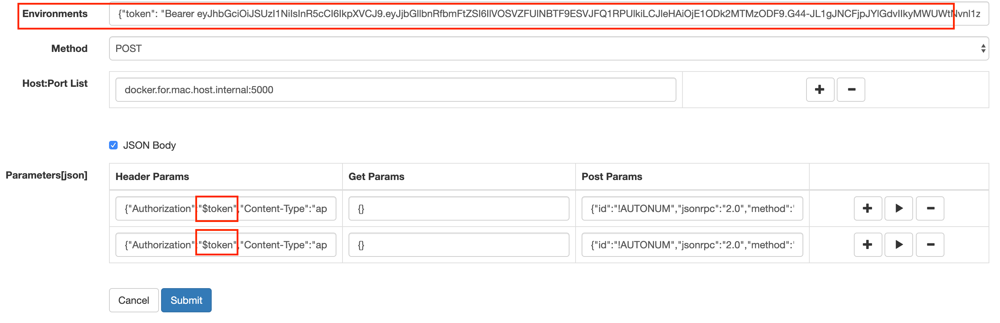
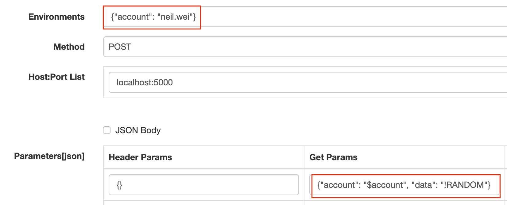
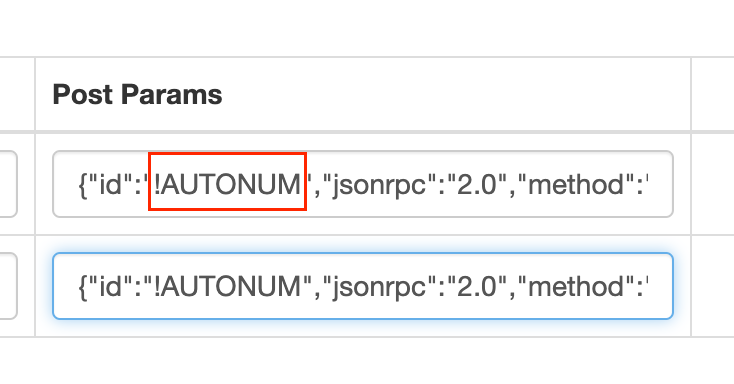

Alex
=================
Alex is one benchmark web UI using golang based on vegeta library & boom. Vegeta provides stabilized qps benchmark library. Boom provided stabilized concurrency benchmark ability.


Alex Architecture
-----------------


Alex Functionalities
-----------------------------------
1. Saves benchmark parameters for repeated usage
2. Saves benchmark reports for future review or sharing
3. Provides simple but direct graphics & text benchmark report
4. Multiple benchmarks can be running concurrently
5. Multiple Host:ports can be tested as a cluster in a single benchmark with load balance supporting
6. Data hotspot can be avoided by providing randomized parameters
7. Provides gradually pressure with step settings
8. Provides simple machine status realtime displaying while benchmark is running

Alex Limitations
-----------------------------------
1. Alex is running in a single process, you should deploy multiple nodes if you need a distrubted environment.you should arrange multiple persons to operate benchmark in the same time.
2. Vegeta will not stop immediately while pressure is overload.Please design your pressure steps carefully & watch your machine status carefully.
3. Qps & Concurrency should not be too large.I once tested vegeta benchmark with helloword web program splitting out 1.5k bytes per request, 60000 qps reaches the limit for the network limitations of Gigabit Ethernet.
4. Gzip decompression should be avoided when doing a massive pressure benchmark.Decompression costs too much cpu to make the report quite inaccurate.You can deploy multiple nodes instead.
5. Report is only for suggestion, you should bravely ask yourself why.

Installing & Run
----------------------------------

Please install `docker` and `docker-compose` first.

```shell
make build
make run

open browser
http://localhost:8000/

```

Configuration
---------------------------
```
{
    "BindAddr": "localhost:8000",
    "MongoUrl": "mongodb://localhost:27017/alex",
    "Teams": [
        "python",
        "java",
        "php",
        "go"
    ]
}

```

References
-----------------------------
1. wonderful vegeta https://github.com/tsenart/vegeta
2. straight-forward boom https://github.com/rakyll/boom

Screenshots
-----------------------------






Notice
-----------------------------
Keep it simple, I will not add more but complex functionalities to Alex.
If there's any bugs or suggestions, please tell me, I will fix it ASAP.


Environment Variable support:
-----------------------------
A JSON value started with `$` will be repalced by the predefined enviornment variable in run time, for example:



It supports the first level of `Header`, `Get Params` and all level for `Post Params`

Magic String Functions
-----------------------------

A GET/POST Params value started with `!` will be repalced by a predefined magic string functions listing below:

- !AUTONUM: Repalce by index of request (e.q, 1)
- !UUID: Repalce by a real UUIDv4 (e.q, 46d3e5b4-e4b6-4ecc-bd5d-11c6543d0905)
- !RANDOM: Replace by a random string with length fixed to 5. (e.q, 1avUL)
- !B64RANDOM: Replace by a random string which encoded by base64. (e.q, z115avPULlhQWZy9Ni47Dw==)

It supports the first level of `Header`, `Get Params` and all level for `Post Params`

GET Example:



Get Params:
```json
{"account": "$account", "data": "!RANDOM"}
```

URL for `GET` will be replaced by `Environments` and `Magic string functions` as following
```
http://localhost:5000/api/v1/internal/rpc?account=neil.wei&data=rtaSg
```


POST Example:



Post Params:
```json
{
  "id": "!AUTONUM",
  "jsonrpc": "2.0",
  "method": "crypto_bulkEncrypt",
  "params": [
    [
      {
        "workspace_id": "!UUID",
        "key_type": "HASH",
        "plaintext": "!B64RANDOM"
      }
    ]
  ]
}
```

Post body will be replaced by the following data while in testing phase.
```json
[
  {
    "id": "1",
    "jsonrpc": "2.0",
    "method": "crypto_bulkEncrypt",
    "params": [
      [
        {
          "workspace_id": "46d3e5b4-e4b6-4ecc-bd5d-11c6543d0905",
          "key_type": "HASH",
          "plaintext": "WUtWTko="
        }
      ]
    ]
  }
]
```
